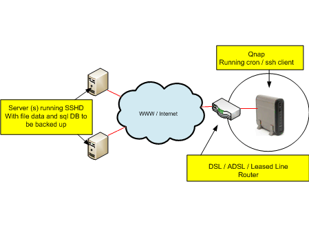

# Introduction

If you run an important server such as web server you should of course take regular off site backups. Now everyone knows that backups are a total pain to do manually and more often than not get forgotten. However, using linux cron you can automate this task easily and be more confident of your ability to recover should anything go wrong with your server and you need to restore. Depending on how much you have to backup and if you have a decent xDSL type connection speed at your home or office you can persuade a QNAP 109 NAS to take care of this for you.



# Backing up like this has some benefits
It is off-site (assuming your qnap is at your home or office and the server you are backing up is in some data centre / ISP somewhere)
It “pulls” the backups from the webserver. Keeping your qnap device behind a natted firewall means it is harder to be compromised as it will simply connect to the remote server then pull down a backup and then log off. If you “pushed” the backup from the remote server to a remote host, most likely you would have to store some connection info and credentials on the remote server. This could be given away should your remote server be hacked. This means your server would be hacked and potentially your backups too. Nasty!
Qnaps are very quiet and don’t use much power. So rather than using a Linux based PC, that could technically do the job just as well, you can leave the qnap on 24/7 without it being too noisy or costly on electricity.

# Install the QPKG
The QPKG is the qnap package manager that lets you expand your qnap’s linux functions and software. We are going to need to replace the default Secure Shell that comes with the QNAP 109 with the OPENSSH package. The following link describes this process: http://wiki.qnap.com/wiki/Install_Optware_IPKG#Automatic_installation_via_QPKG

## Replace the default qnap SSH
The following link describes this process. http://wiki.qnap.com/wiki/How_To_Replace_SSH_Daemon_With_OpenSSH.  Complete this task then come back here.

# Prepare the Qnap and your remote server for Automated Backups

Create a user on your qnap and on your remote server

Choose a username and create that user on both your qnap and your remote server in my example I am going to use the name “dave” SSH to the qnap as admin, then add the user and set its home directory which in my example will be /share/HDA_DATA/dave
```
adduser -h /share/HDA_DATA/dave dave
```
Do the same with the remote server, this time in my example I am creating the users home directory on a remote redhat box under /home/dave

```
adduser -h /home/dave dave
```
Change the newly created users password
```
passwd dave
```
Create public/private key pair Now let’s create a public / private key pair to allow the qnap to log onto the remote redhat server without a password. This is perfect for automated (cron) backup scripts. Logon to the Qnap as user dave (or your user) and type

```
ssh-keygen -t rsa
```
Which should return this:
```
Generating public/private rsa key pair.
```
And after a moment you will be asked where you wish to write your private key to,
```
Enter file in which to save the key (/share/HDA_DATA/dave/.ssh/id_rsa):
```
You can accept the default. Next will be the passphrase you wish to use with this key. For this example we want no passphrase.
```
Enter passphrase (empty for no passphrase):
```
Simply press enter or return. This will create a “phraseless” keypair. This should complete and it will return the place where it has left your private and public keys.
```
Your identification has been saved in /share/HDA_DATA/dave/.ssh/id_rsa.
Your public key has been saved in /share/HDA_DATA/dave/.ssh/id_rsa.pub.
```
he private key (id_rsa) should always be kept safe – and as your qnap is hidden behind a natted firewall (it is I hope?) and that for security’s sake you don’t allow any kind of remote access to the qnap from the internet you should be safe-ish. Now we need to copy the public key up to the remote host under the “dave” user’s we created earlier home directory. Normally something like this on a red hat box /home/dave/.ssh or for Solaris /export/home/daves. This is done most simply by copying the file using scp. Note! Ensure there is a /home/dave/.ssh directory on the remote server first before trying the command. If there isn’t just create one as normal (mkdir /home/dave/.ssh)
```
scp id_dsa.pub dave@www.myserver.com:/home/dave/.ssh/id_rsa.pub
```
Now that’s copied login to the remote SSH server (in my example it is www.myserver.com) and then append the id_rsa.pub file to the authorized_keys file.
```
cat /home/dave/.ssh/id_rsa.pub >> authorized_keys
```
Don’t forget to ensure the user dave .ssh directory and the authorised keys are set to permissions 700 on both the remote and local servers. Now you can test it by running the following command from the QNAP

```
ssh dave@www.myserver.com
```
Now if it logs in without a password you have done it! If you are prompted for a password the best thing to do is double check that the permissions on the qnap and the remote servers .ssh directory and sub directories are set to 600. Which looks like this:
```
dr-x------ 2 dave dave 4096 May 14 18:14 .ssh
```
 