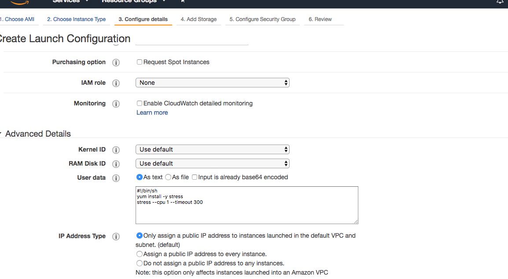
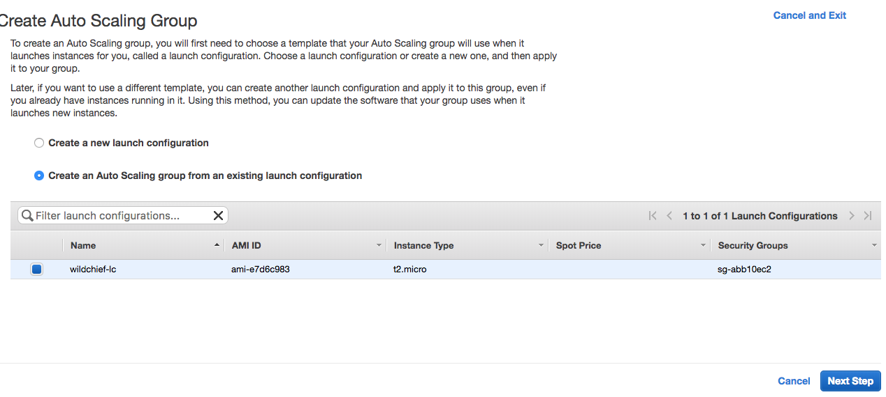
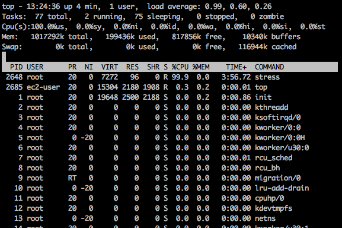
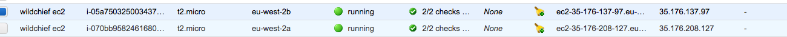

AWS auto-scalers, to me at least, are the service that standout as being one of the most “Elastic-y” in the Elastic offerings from AWS. They can be configured to automatically expand and shrink on demand.  Which by most definitions is pretty elastic. 

Auto-scalers can be configured to fire up more ec2 compute instances when demand on already running instance(s) reaches a user definable threshold.  For example if you have a group of ec2 compute instances working on a queue of jobs and that queue is keeping all of the server's processor tied up consistently for say, 10 minutes the auto-scaler will detect this and launch up another ec2 instance.

The following example will show you how to test this and watch while an EC2 instance’s CPU gets busy, the auto-scaler notices this and  automatically fires-up another instance. We will use the “stress” utility to  force the server to “get busy” so we can watch for another instance to launch.

1. Create a Auto-scaling launch configuration.  This is an object that defines the EC2 instance you are wish to launch. For example, it is here that you set parameters like instance type, User data and storage.  I am going to setup a LC that will launch an t2.micro, AWS Linux and 8GB of storage.  Pretty standard stuff except I am  going to install the “stress” utility on our instance and set it to “stress” the CPU by injecting this bash code in the user data section.

```bash
#!/bin/sh
yum install -y stress
stress --cpu 1 --timeout 300
```

See the screen shot below:



This just has the effect of hammering the instance’s CPU for 300 seconds, which should be enough for the autoscaler to notice the cpu loaded and launch another Ec2 Instance.

2. Setup the Autoscaler Group.  This is where we set up the actual autoscaler to launch an initial instance, monitor  CPU and launch another instance if the CPU hits a defined threshold.

For the purpose of the example we will set the CPU to be the measured metric and keep it quite low 30%) so we can easily exceed this cpu metric and see the next instance being launched quite quickly without too much waiting around.

So next create a new auoscaling group, name it and select the launch configuration created in the previous step.



We setup the autoscaler name, the group size which we start with 1 instance. Fill in relevant VPC nd subnet data. For the purpose of the test using the default VPC is fine.
Next we configure the autoscaling policies, and we select the "Using scaling policies to adjust the capacity of this group"


Set the scale between 1 and 2 instances and the metric type of Average CPU utilisation and a target value of 30.

Save this Autoscaling group and it should now be created. If all goes well we should see the first instance being lauched in the EC2 instance list.


Once the instance is launched we can SSH to it. And see if our stress command has indeed caused some stress by running the top command.



It certainly has caused some stress, the cpu utilisation is now at 99% which will be enough to trigger the autoscaler to launch another instance.

Let’s check the EC2 console and see if there is a second instance on it’s way



Yep there is. And if you look at the EC2 autoscaler group history we can see the event when the second server is launched and eventually when the CPU stress test is over all we see a follow up event when the very first EC2 instance be terminated.


