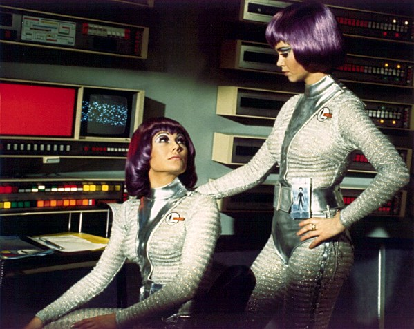
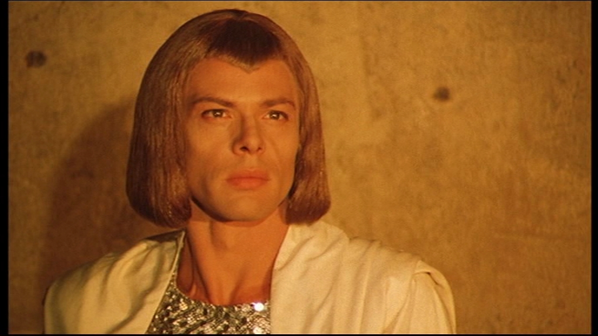

The aliens and civilisations in movies from the 1960s, 70s and 80s often sported a splendid space bob.  Before I compiled this blog post I couldn't tell you which films and TV programmes had them I knew they existed. 

## 1. UFO
 UFO is a British TV series created by Thunderbird's creator Gerry Anderson.  I have never watched this series but I did spot that the space ladies hair is regulation purple Space Bob.

## 2. Warlords of Atlantis
Warlords of Atlantis is 1978 Doug McClure Classic Sci-Fi adventure. Well sort of, it isn't actually set in space or even set in the future, instead the film mostly takes place under the sea in Atlantis in the late 19th Century. However, but the alien civilisation  originated from Space.  How do I know, well one of the main aliens Atmir, has a Space bob complete with Widows peak.  Also I think they tell you in the story.

