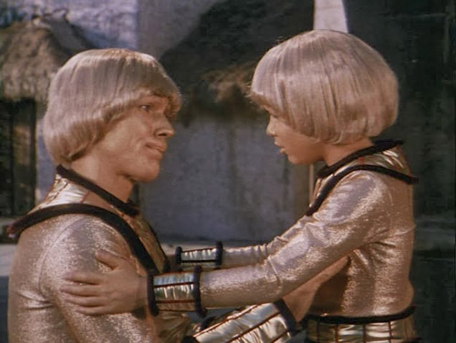
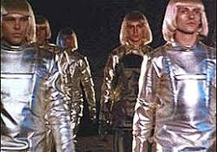
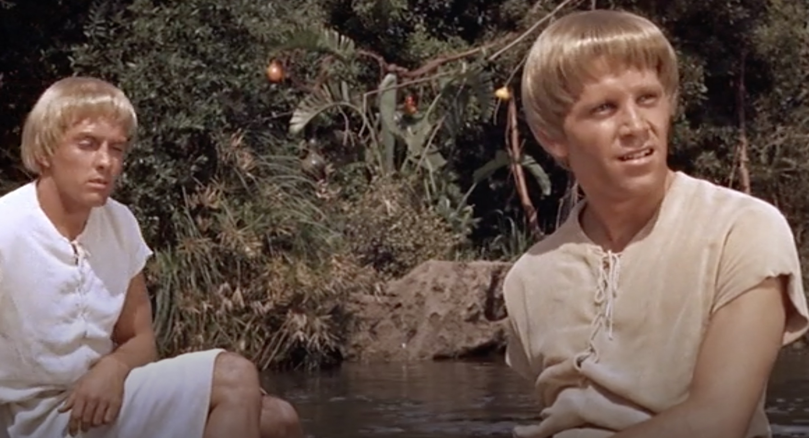
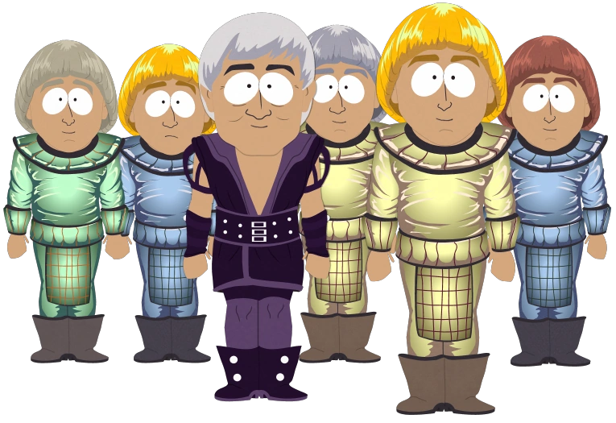

The aliens and civilisations in movies from the 1960s, 70s and 80s often sported a Sci-Fi bob.  Before I compiled this blog post I couldn't put my finger on which films and TV programmes featured characters with space bobs but even so I kind of knew they existed. 

# The list

## 1. UFO
UFO is a British TV series created by Thunderbird's creator Gerry Anderson.  I have never watched this series, although it gets a respectable score (7.9 at the time of writing) on IMDB. Nevertheless,  I did spot that the space ladies' hair is regulation purple Sci-Fi bob.

## 2. Warlords of Atlantis
Warlords of Atlantis is a 1978 Doug McClure classic Sci-Fi adventure. Well sort of, it isn't actually set in Space or even set in the future, instead the film mostly takes place under the sea in Atlantis in the late 19th Century. However, the alien civilisation  originated from outer space.  How do I know they came from Space? Well one of the main aliens, Atmir, has a Sci-Fi bob complete with pronounced widow's peak.  Also if I recall correctly they tell you all about the alien plot line in the story.

## 3. Buck Rogers Golden Man
Buck Rogers is a U.S Sci-Fi series with plenty of ridiculous aliens and costumes.  In one episode entitled the Golden Man, the golden boy and few others all have the Sci-Fi bob. And very convincing they look too.

## 4. War of the Robots
War of the Robots.  Hmm, I haven't watched this film, and looking at the screenshots on the web, I don't know if I could bring myself to. Hey who knows, maybe I am missing out, anyway I do know that some of the "robots" have shiny Sci-Fi bobs.

## 5. Dr Who - Series 18: Meglos
Meglos is from the Tom Baker period of Dr Who, a pretty iconic period of the show. Although, personally I felt that the 4th Dr Who had gone off the boil by series 18. However, saying that, this story isn't too bad. Made all the better by the cracking Sci-Fi Bob hair styles of one of the races in the serial, the Savants.

## 6. The Time Machine: Male Eloi
In The Time Machine film from 1960, the Eloi or at least male Eloi do, have Sci_Fi bobs.  The females don't though and just have normal 1950/60s hair and I am not sure why that is the case, the good news is that the fellas certainly do, earning them a place on this list.

# Honourable Mentions

## 1. SouthPark: United Atheist Alliance
The United Atheist Alliance are a race of people descended from present day mankind, or something like that.  They mostly seem to have the Sci-Fi bob.  The reason this is not in the main list, is because a lot of this episode is Southparks's marvellous parody of 1970s Sci-Fi like Buck Rogers and Battle Star Galactica etc. 

